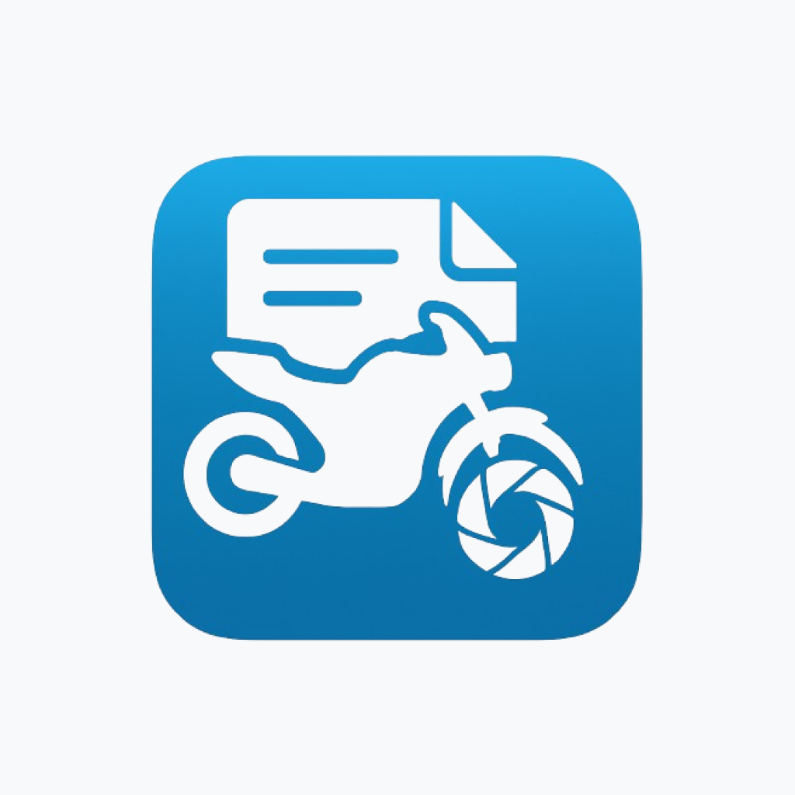
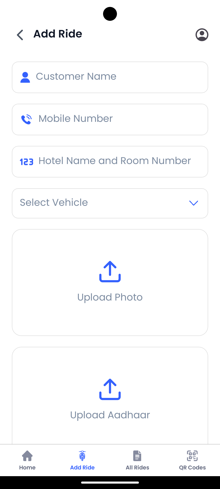
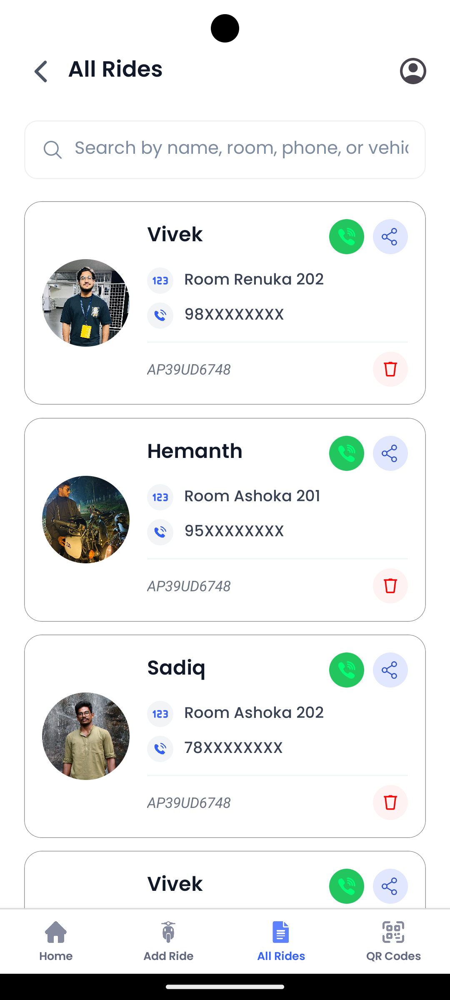
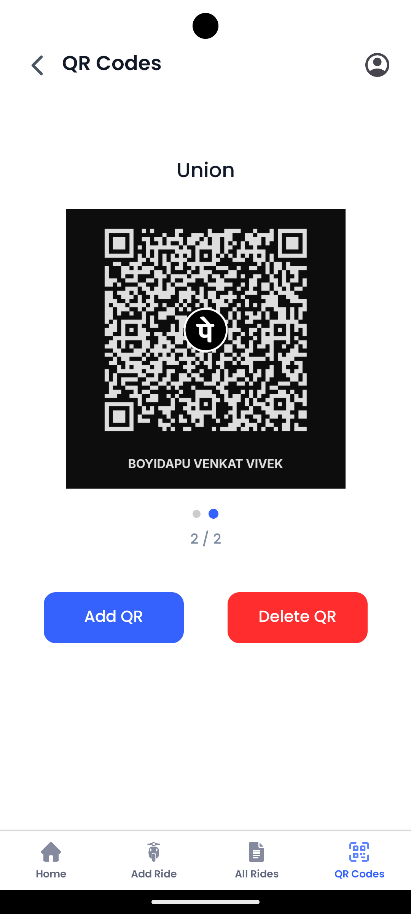
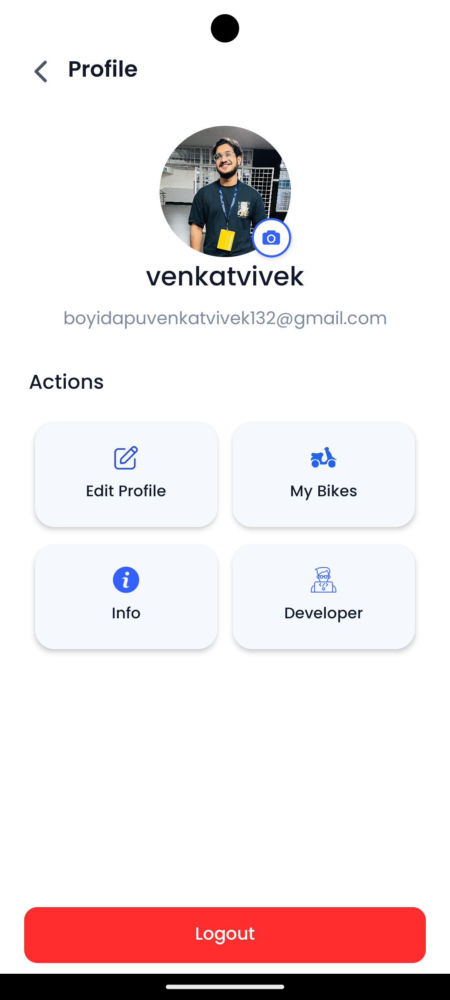
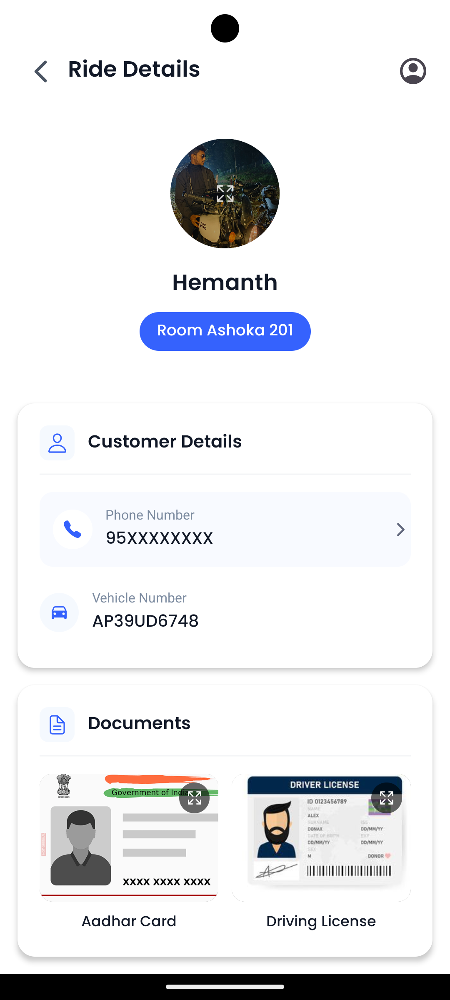

<h1 align="center">Capture Ride</h1>  

<p align="center">
  
</p>

<p align="center">
  A mobile application designed for <b>bike rental vendors</b> to easily manage and document customer details, including capturing images of their Aadhaar cards and driving licenses.  
</p>

---

## ✨ Features
- 📷 Capture and store Aadhaar & Driving License images  
- 👤 Maintain customer records with ease  
- 🔒 Secure data handling  
- ⚡ Fast and user-friendly interface  

---

## 🛠️ Tech Stack
- **Frontend:** React Native (Expo)  
- **Backend:** Node.js, Express  
- **Database:** MongoDB  
- **Other Tools:** REST API, Cloudinary  

---

## 📸 Screenshots
<p align="center">
  <table align="center">
    <tr>
      <td align="center"><br/>🏠 Home</td>
      <td align="center"><br/>➕ Add Ride</td>
      <td align="center"><br/>📋 All Rides</td>
    </tr>
    <tr>
      <td align="center"><br/>🔗 QR</td>
      <td align="center"><br/>👨‍💻 Profile</td>
      <td align="center"><br/>📊 Ride Data</td>
    </tr>
  </table>
</p>

---

## 📥 Download

<p align="center">
  <a href="https://expo.dev/accounts/captureride132/projects/CaptureRide/builds/1a9719b3-a035-4478-990c-d09fdcf8d1ad">
    
  </a>
</p>


---

## 📦 Installation & Setup  

1. Clone the repository  
   ```bash
   https://github.com/boyidapuvivek/CaptureRide.git
   cd CaptureRide
2. Install dependencies
   ```bash
   npm install
   or
   yarn install
3. Run the app
   ```bash
   npx expo run:android
   or
   npx expo start(expo go)
